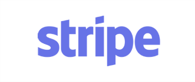

# Red Cat and Co

# Description
COVID-19 brought swift change to the world. Small business owners felt the intense pressure to adapt. Unable to maintain a storefront appearance due to physical spacing limitations and safety concerns, Red Cat & Co transitioned to a virtual shopping experience with a ’70s vibe to present local small business merchandise in one convenient location all at the click of a button.

This is an interactive MERN stack single page application (SPA) fulfilling client needs for a revamped, versatile website.

## Table of Contents
  * [Installation](#installation)
  * [Usage](#usage)
  * [License](#license)
  * [Contributing](#contributing)
  * [Resources](#resources)
  * [Questions](#questions)

## Installation
Download a copy of this repo to a directory of your choice. To install, you will need to run `npm i` or `npm install` to get all the dependencies running. Following proper installation of the dependencies, you will type `npm start` on the root directory terminal to start the server.

## Usage
Be sure all repository files were successfully cloned to server and a connection to the database is complete.

Customers will have the ability to create an account through a signup form found on the `Navigation Bar` whereupon users can add items to their cart if so desired. Utilization of the `Navigation Bar` or homepage buttons will help customers select shopping items for purchase. Once items are stored in the cart, customers will be able to checkout via Stripe before being redirected back to the `Red Cat & Co` website. 

Text

Text

## License
 This project is covered by the MIT license.

## Contributing
At this time, we are not seeking contributions to this application for `Red Cat & Co`.

## Resources
 

 

 

 

 

 

 

## Questions
Please contact [Red Cat & Co](https://redcatandco.com/) for immediate questions regarding site content and vendor relations.

The technical questions and concerns, the available developers are 
[GildedRose](https://github.com/GildedRose),
[ericy98](https://github.com/ericy98),
[Devmadia](https://github.com/Devmadia),
[Dblply21](https://github.com/Dblply21).